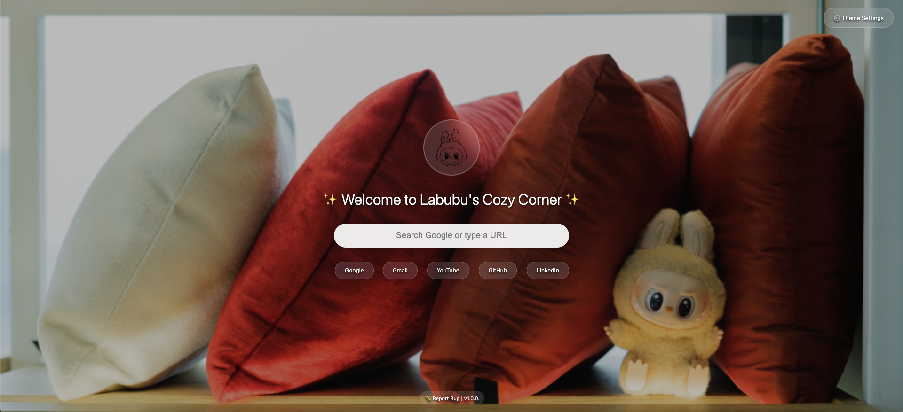
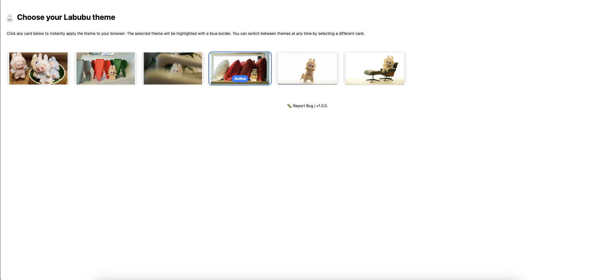

# Labubu Theme Browser Extension

Transform your browsing experience with adorable Labubu themes! This browser extension brings the charming world of Labubu to your new tab page with beautiful backgrounds and a clean, minimalist design.

## ✨ Features

- **Beautiful Labubu Backgrounds**: Enjoy 6 high-quality Labubu-themed images that rotate on your new tab page.
- **Clean & Minimal Design**: Uncluttered interface that puts the focus on your content.
- **Cross-Browser Support**: Available for both Chrome and Firefox.
- **Lightweight & Fast**: Minimal impact on browser performance.
- **Easy Customization**: Simple options page for theme preferences.

## 🚀 Installation

### Chrome
1. Download or clone this repository.
2. Open Chrome and navigate to `chrome://extensions/`.
3. Enable "Developer mode" in the top right.
4. Click "Load unpacked" and select the `chrome/` folder.
5. Enjoy your new Labubu-themed new tab page!.

### Firefox
1. Download or clone this repository.
2. Open Firefox and navigate to `about:debugging`.
3. Click "This Firefox" → "Load Temporary Add-on".
4. Select the `manifest.json` file from the `firefox/` folder.
5. Enjoy your new Labubu-themed new tab page!

## 📁 Project Structure

```
labubu-theme-browser-extension/
├── chrome/                 # Chrome extension files
│   ├── manifest.json      # Chrome extension manifest
│   ├── newtab.html        # New tab page HTML
│   ├── newtab.js          # New tab page JavaScript
│   ├── options.html       # Settings page HTML
│   ├── options.js         # Settings page JavaScript
│   ├── service_worker.js  # Background service worker
│   ├── icons/             # Extension icons
│   └── images/            # Labubu background images
├── firefox/               # Firefox extension files
│   ├── manifest.json      # Firefox extension manifest
│   ├── newtab.html        # New tab page HTML
│   ├── newtab.js          # New tab page JavaScript
│   ├── options.html       # Settings page HTML
│   ├── options.js         # Settings page JavaScript
│   ├── service_worker.js  # Background service worker
│   ├── icons/             # Extension icons
│   └── images/            # Labubu background images
└── README.md
```

## 🛠️ Development

### Prerequisites
- Modern web browser. (Chrome or Firefox)
- Text editor or IDE.
- Basic knowledge of HTML, CSS, and JavaScript.

### File Overview

#### Chrome Extension Files
- **manifest.json**: Defines extension permissions, icons, and functionality.
- **newtab.html**: The HTML structure for the new tab page.
- **newtab.js**: Handles background image rotation and interactions.
- **options.html**: Settings page for user preferences.
- **options.js**: Manages settings and user preferences.
- **service_worker.js**: Background service worker for extension lifecycle.

#### Firefox Extension Files
- Similar structure to Chrome, adapted for Firefox's WebExtensions API.

### Background Images
The extension includes 25 high-quality Labubu-themed background images:
- `labubu-01.jpg` through `labubu-25.jpg`
- Images are stored in the `images/` directory for each browser
- Configured via `images.json` for easy management

## 🎨 Customization

### Adding New Background Images
1. Add your new images to the `images/` folder.
2. Update `images.json` with the new image filenames.
3. Ensure images are optimized for web (recommended: 1920x1080, <500KB each).

### Modifying Extension Behavior
- Edit `newtab.js` to change image rotation logic.
- Modify `options.js` to add new settings.
- Update `manifest.json` to adjust permissions or functionality.

## 📸 Screenshots


*Description of screenshot 1: The new tab page with Labubu background.*


*Description of screenshot 2: The options page for customizing the extension.*

## 🤝 Contributing

Contributions are welcome! Feel free to:
- Report bugs.
- Suggest new features.
- Submit pull requests.
- Share your own Labubu images.

## 📄 License

This project is open source and available under the [Apache License 2.0](LICENSE).

## 🙏 Acknowledgments

- Images from [Unsplash](https://unsplash.com/).
- Icon SVG files from [Free SVG Download](https://www.freesvgdownload.com/labubu-free-svg-files/).
- Built with love for plush toy enthusiasts everywhere.

## 🔗 Links

- [Chrome Web Store](https://chrome.google.com/webstore) - *Coming soon*
- [Firefox Add-ons](https://addons.mozilla.org/) - *Coming soon*
- [GitHub Repository](https://github.com/amirshnll/labubu-theme-browser-extension)

---

Made with ❤️ for Labubu fans everywhere!